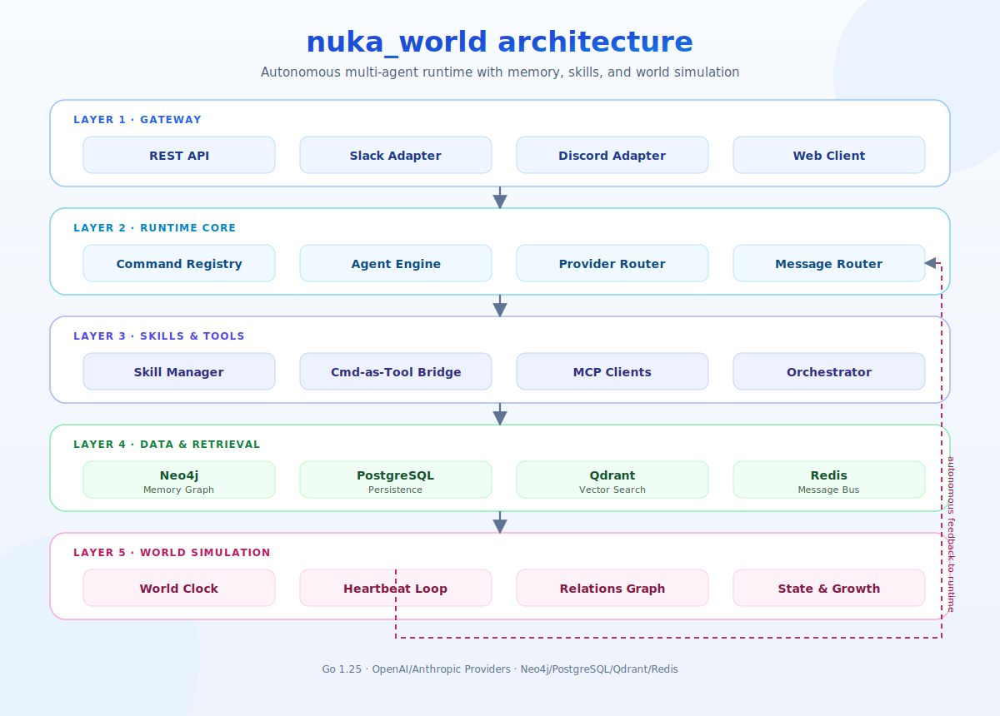

<div align="center">

# `> nuka_world`

**Autonomous Multi-Agent System with Memory, Skills & World Simulation**

[](https://go.dev)
[](LICENSE)
[](Dockerfile)
[](https://neo4j.com)
[](https://postgresql.org)

<br>

*A living world where AI agents think, remember, collaborate, and evolve.*

</div>

---

## Architecture

<div align="center">

</div>

## Features

| Category | Description |
|----------|-------------|
| **Multi-Agent Engine** | Register, execute, and manage multiple AI agents with independent personas, memories, and goals |
| **Memory Graph** | Neo4j-backed spreading activation memory — agents recall relevant context automatically |
| **RAG Pipeline** | Qdrant vector store + embedding providers for retrieval-augmented generation |
| **Skill System** | Pluggable skills assigned per-agent, with built-in + user-defined skill support |
| **Command-as-Tool Bridge** | All slash commands are auto-exposed as LLM-callable tools via function calling |
| **World Simulation** | World clock, heartbeat-driven autonomous thinking, relation graphs, state & growth tracking |
| **Multi-Platform Gateway** | REST API + Slack + Discord adapters with unified message routing |
| **Orchestrator** | Redis-backed message bus with scheduler and steward for multi-agent coordination |
| **Agent Profiles** | `SOUL.md` / `Agent.md` / `GOALS.md` per agent — personality, role, and goals injected into system prompt |
| **MCP Integration** | Connect external tool servers via Model Context Protocol |

## Quick Start

### Prerequisites

- Go 1.25+
- Neo4j (memory graph)
- PostgreSQL (persistence)
- Redis (orchestrator)
- Qdrant (optional, for RAG)

### Run Locally

```bash
# Clone
git clone https://github.com/nidhogg/nuka-world.git
cd nuka-world

# Configure
cp configs/nuka.example.json configs/nuka.json
# Edit configs/nuka.json with your database URIs and API keys

# Build & Run
go build -o nuka ./cmd/nuka
./nuka
```

### Run with Docker

```bash
docker compose up -d
```

The API server starts on `:8080` by default.

## Slash Commands

All commands can be triggered directly via the API or invoked by the World agent through natural language (Command-as-Tool bridge).

| Command | Usage | Description |
|---------|-------|-------------|
| `/help` | `/help` | List all available commands |
| `/agents` | `/agents` | List registered agents |
| `/tools` | `/tools` | List available tools |
| `/skills` | `/skills` | List loaded skills |
| `/status` | `/status` | Show gateway adapter status |
| `/create_agent` | `/create_agent <name> <personality>` | Create a new agent |
| `/create_skill` | `/create_skill <agent_id> <description>` | Create and assign a skill |
| `/create_team` | `/create_team <name> <id1,id2,...>` | Create an agent team |
| `/create_schedule` | `/create_schedule <agent_id> <type> <desc>` | Schedule a task |
| `/agent_info` | `/agent_info <agent_id>` | Get agent details |
| `/remove_agent` | `/remove_agent <agent_id>` | Remove an agent |
| `/assign_skill` | `/assign_skill <agent_id> <skill_id>` | Assign skill to agent |
| `/unassign_skill` | `/unassign_skill <agent_id> <skill_id>` | Remove skill from agent |
| `/remember` | `/remember <agent_id> <content>` | Store a memory |
| `/forget` | `/forget <agent_id> <keyword>` | Delete matching memories |
| `/recall` | `/recall <agent_id> <query>` | Retrieve memories |
| `/assign_task` | `/assign_task <agent_id> <task>` | Assign task to agent |
| `/broadcast` | `/broadcast <message>` | Broadcast to all agents |
| `/team_msg` | `/team_msg <team> <from> <to> <msg>` | Inter-agent team message |
| `/search` | `/search <agent_id> <query>` | RAG search (if enabled) |

## Agent Profiles

Each agent has a profile directory under `agents/<id>/` with three files:

```
agents/
  world/
    SOUL.md      # Personality, values, communication style, boundaries
    Agent.md     # Role, capabilities, tools, provider config
    GOALS.md     # Short-term and long-term goals
  _template/     # Copied for new agents via /create_agent
```

These files are loaded into the system prompt at execution time, giving each agent a persistent identity.

## Project Structure

```
cmd/nuka/          # Application entrypoint
internal/
  agent/           # Agent engine, tool registry, profiles
  api/             # HTTP handler (chi router)
  command/         # Slash command registry + bridge
  config/          # Configuration loader
  embedding/       # Embedding providers
  gateway/         # REST, Slack, Discord adapters
  mcp/             # Model Context Protocol client
  memory/          # Neo4j memory graph with spreading activation
  orchestrator/    # Redis message bus, scheduler, steward
  provider/        # LLM provider router (OpenAI, Anthropic)
  rag/             # RAG orchestrator
  router/          # Message router
  skill/           # Skill manager + built-in skills
  store/           # PostgreSQL persistence
  vectorstore/     # Qdrant vector store client
  world/           # World simulation (clock, heartbeat, relations, state)
agents/            # Agent profile directories
skills/            # Plugin skill definitions
migrations/        # PostgreSQL migrations
web/               # Next.js frontend
```

## License

MIT

---

<div align="center">
<sub>Built with caffeine and mass amounts of LLM tokens.</sub>
</div>
