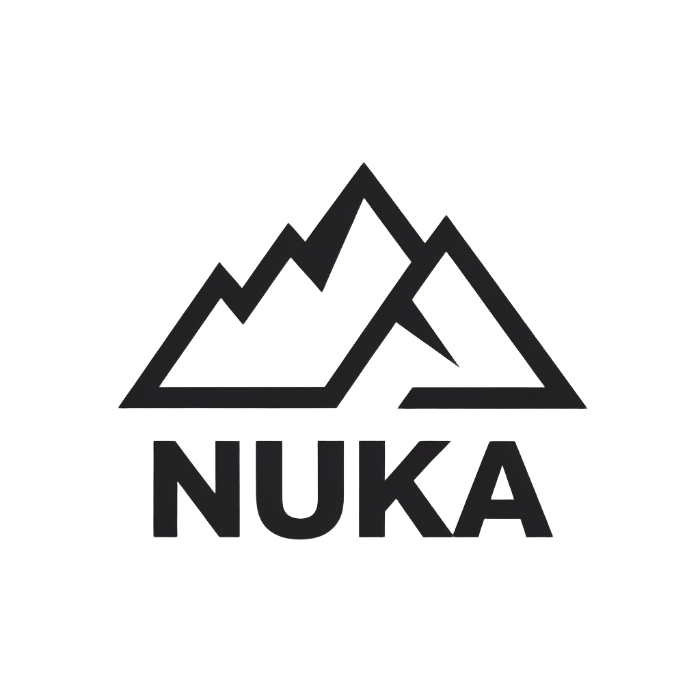
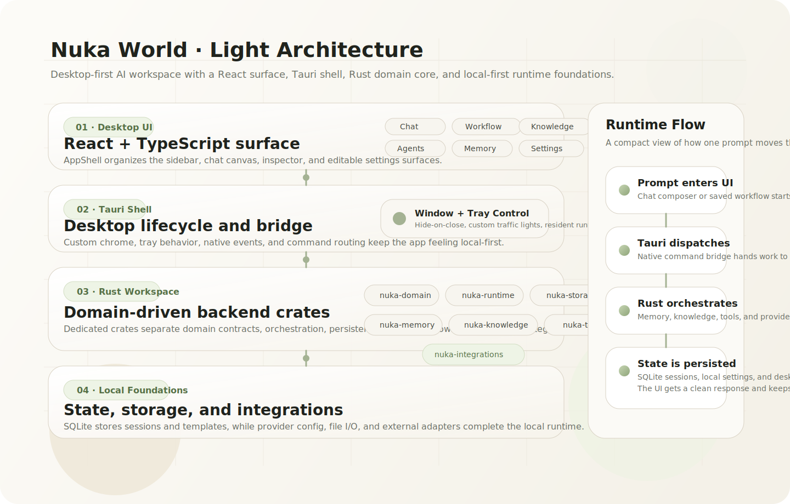
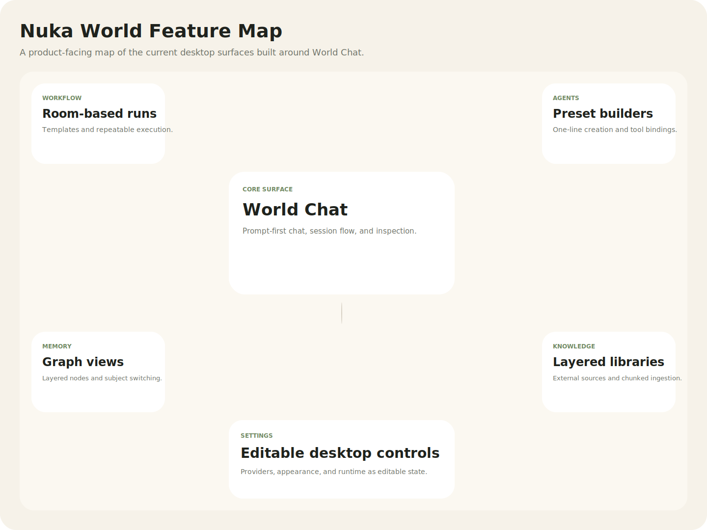

<p align="center">
  
</p>

<h1 align="center">Nuka World Desktop</h1>

<p align="center">
  一个基于 <code>Rust</code>、<code>Tauri 2</code>、<code>React</code> 与 <code>TypeScript</code> 构建的 desktop-first AI 工作台。
</p>

<p align="center">
  
  &nbsp;
  
  &nbsp;
  
  &nbsp;
  
</p>

<p align="center">
  <a href="./README.md"></a>
  &nbsp;
  <a href="./README.zh-CN.md"></a>
</p>

<p align="center">
  以 World Chat 为中心，组织工作流、Agent、记忆、知识库与运行时控制等多层桌面能力。
</p>

---

## 当前产品

Nuka World 当前作为一个聚焦的桌面 AI 工作空间，包含以下主界面：

- `Chat`：提示词优先的对话入口、空态引导与会话检查器
- `Workflow`：面向房间与模板的可复用执行方式
- `Agents`：一句话创建与工具绑定的 Agent 预设入口
- `Memory`：图式、多层级、可切换主体的记忆查看方式
- `Knowledge`：外部知识源接入、分块摄取与分层组织
- `Settings`：可编辑的 `Providers`、`Appearance` 与 `Runtime` 状态

---

## 轻量架构

<p align="center">
  
</p>

当前架构保持清晰分层：

- `Desktop UI`：负责 shell、聊天画布、设置表单与主要产品页面
- `Tauri Shell`：负责原生生命周期、托盘行为与命令桥接
- `Rust Workspace`：负责领域、运行时、存储、记忆、知识、工具与集成模块
- `Local Foundations`：负责会话与设置持久化，并连接 provider 与本地资源

---

## 功能地图

<p align="center">
  
</p>

这张功能图对应当前的产品形态：

- `World Chat` 是主入口与核心对话表面
- `Workflow`、`Agents`、`Memory`、`Knowledge`、`Settings` 作为外围工作台模块
- 所有页面都运行在同一个桌面 shell 与 local-first runtime 模型内

---

## 运行时模型

- `Local-first shell`：通过 `Tauri 2` 提供原生窗口、托盘与生命周期控制
- `Rust workspace`：承载编排、存储、记忆、知识、工具与集成能力
- `React application`：负责路由、可编辑表单与桌面交互模式
- `SQLite foundation`：为会话、模板与配置提供本地持久化基础

---

## 工作区结构

```text
apps/
  desktop/
    src/
    src-tauri/
crates/
  nuka-domain/
  nuka-runtime/
  nuka-storage/
  nuka-memory/
  nuka-knowledge/
  nuka-tools/
  nuka-integrations/
docs/
  images/
  logo/
  plans/
  design.pen
```

---

## 开发命令

```bash
cargo test --workspace
npm.cmd --prefix apps/desktop test
npm.cmd --prefix apps/desktop run build
```

---

## 许可证

本项目采用 `Apache-2.0` 许可证，详见 `LICENSE`。
